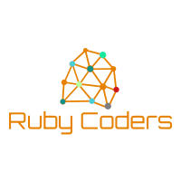

The RubyCoders is an informal group that holds weekly meetings where we take an online, collaborative, and hands-on approach to learning computer programming and electronics using the  <a href="https://arduino.cc" target="_blank">Arduino platform</a>.

Through our activities, we explore a variety of topics such as `Microcontrollers`, `Arduino Platform`, `Electronics`, `Computer programming`, `Problem-solving`, and `Autonomous learning`.

We meet on Zoom and use an online simulator, <a href="https://www.tinkercad.com/circuits" target="_blank">Tinkercad Circuits</a>, to increase the accessibility of our activities. Every Thursday, between 4 and 6PM, we work on real-world projects and troubleshooting challenges designed to stimulate the group into learning together and comprehensively.

## Contact
If you are interested in joining, you can reach out to us by [clicking here](join). 

You can also contact us through <a href="https://educationmakers.ca" target="_blank">our website</a> or follow us on Social media:

Facebook: <a href="https://www.facebook.com/educationmakers1" target="_blank">EducationMakers</a>

Twitter: <a href="https://twitter.com/educationmakers" target="_blank">@educationmakers</a>